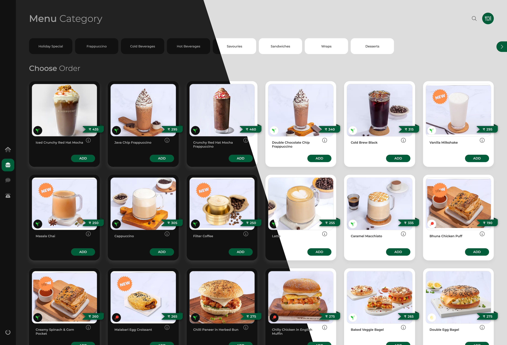
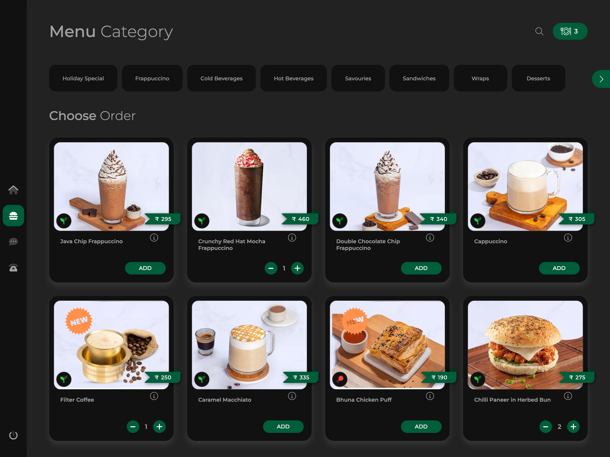
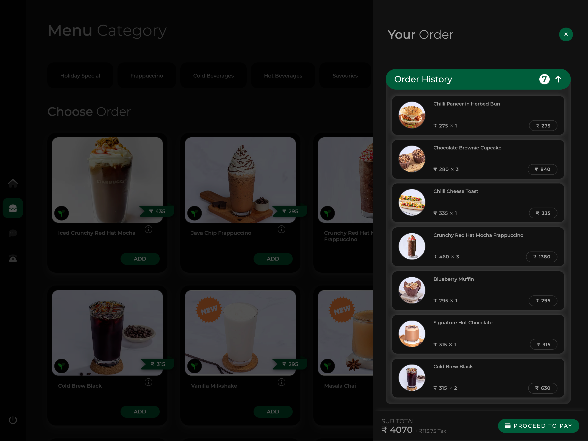
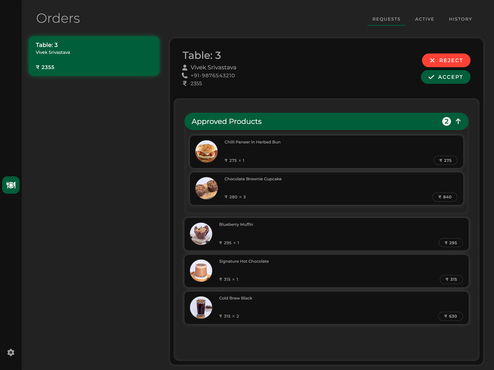
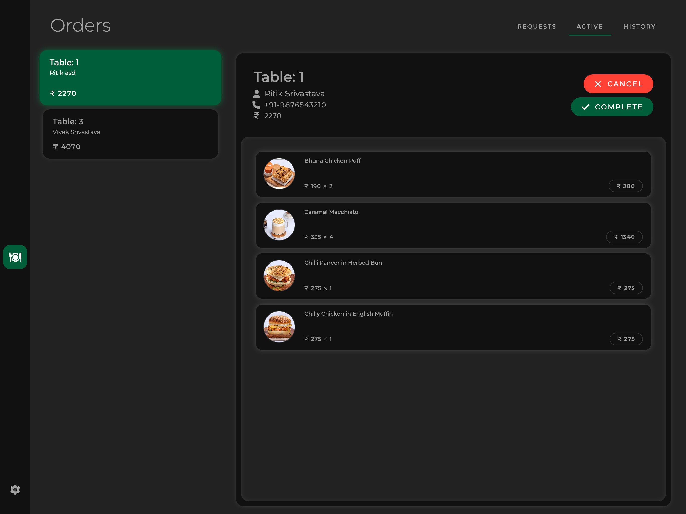

 

# OrderWorder - Contactless Dining Experience

Introducing OrderWorder, our Contactless Dining Full-Stack Platform! This groundbreaking platform transforms the dining experience, enabling restaurants to effortlessly swap out traditional menus with a digital, contactless solution.

## Features

- **QR Code Integration**: Each table is equipped with a QR code for easy access to the application.
- **Ordering System**: Customers can browse the menu, place orders, and make payments directly through the intuitive web app.
- **Admin Dashboard**: Enables restaurant management, order acceptance/rejection, inventory, and payroll management.
- **Kitchen Dashboard**: Chefs receive live updates on incoming orders for efficient food preparation.
- **Real-Time Functionality**: Built using Next.js and SCSS to ensure a responsive and real-time user experience.

## Tech Stack

- **FullStack**: Next.js and SASS
- **Database**: Mongo

## How to Use

1. **Setup QR Codes**: Place QR codes on each table to enable access for customers.
2. **Access the Web App**: Customers can scan the QR code using their smartphones to open the web app and start ordering.
3. **Admin Dashboard**: Access the admin panel to manage restaurants, accept/reject orders, and handle inventory and payroll.
4. **Kitchen Dashboard**: Chefs can use the kitchen dashboard to stay updated on live orders for timely preparation.

## Try it out
Orderworder has two interfaces, one for **customers** and one for **restaurant's admin**.

### Customer Login:
<table>
	<tr>
		<td>
			<ul>
				
				<li>Goto <a href="https://orderworder.ritik.me/starbucks?table=1">Starbucks Menu Page</a> or Scan the QR Code</li>
				<li>Click on order button</li>
				<li>Enter Name and Phone (10 digit number format)</li>
				<li>Login complete, now add few items in cart and place order</li>
				
			</ul>
		</td>
		<td width="200px">
			

				<picture>
					<source media="(prefers-color-scheme: dark)" srcset="public/screenshots/restaurant_qrcode_dark.png" />
					<source media="(prefers-color-scheme: light)" srcset="public/screenshots/restaurant_qrcode_light.png" />
					
				</picture>
			

		</td>
	</tr>
</table>

### Admin Login (Open in separate browser):
<table>
	<tr>
		<td>
			<ul>
				
				<li>Goto <a href="https://orderworder.ritik.me">Homepage</a>, and scroll down to login section</li>
				<li>Enter email: <code>admin@starbucks.com</code></li>
				<li>Enter password: <code>starbucks@123</code></li>
				<li>Login complete, Now visit <a href="https://orderworder.ritik.me/dashboard">Admin Dashboard</a> or <a href="https://orderworder.ritik.me/kitchen">Kitchen Dashboard</a></li>
				
			</ul>
		</td>
	</tr>
</table>

## Screenshots

#### Restaurant Menu:

	
	

#### Admin Dashboard:

	
	

